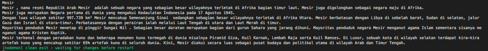

# crawling wikipedia

- [1.Title](#Title)
- [2.Pages](#Pages)
- [Output](#Output)
- [Sources](#Sources)

# Title
* endpoint pencarian title :
`https://id.wikipedia.org/w/api.php?action=query&list=search&utf8=&format=json&srsearch=alan%20turing`

* response pencarian title :
  ```javascript
  {
    batchcomplete: '',
    continue: { sroffset: 20, continue: '-||info' },
    query: {
      searchinfo: { totalhits: 491 },
      search: [
        [Object], 
        [Object], 
        [Object],
        [Object], 
        [Object], 
        [Object],
        [Object], 
        [Object], 
        [Object],
        [Object], 
        [Object], 
        [Object],
        [Object], 
        [Object],
        [Object],
        [Object], 
        [Object], 
        [Object],
        [Object], 
        [Object]
      ]
    }
  }
  ```
* regex mengganti spasi dengan %20 : `title = title.replace(/^\s+|\s+|\s+$|\s+(?=\s)/g, "%20");`

# Pages
* endpoint pencarian pages : 
`https://id.wikipedia.org/w/api.php?format=json&action=query&prop=extracts&exintro=&explaintext=&titles=muhammad`

* response pencarian halaman :
  ```javascript
    { 
      batchcomplete: '', 
      query: 
      { 
        pages: 
        { 
          '5422': [Object] 
        } 
      } 
    }
  ```

# Output
  

# Sources
- [1. StackOverFlow - wikipedia api](https://stackoverflow.com/questions/9577611/http-get-request-in-node-js-express)
- [2. StackOverFlow - nested json parsing](https://stackoverflow.com/questions/39094162/parsing-nested-json-in-nodejs)
- [3. StackOverFlow - regex sapce/tab reaplacement ](https://stackoverflow.com/questions/1981349/regex-to-replace-multiple-spaces-with-a-single-space)